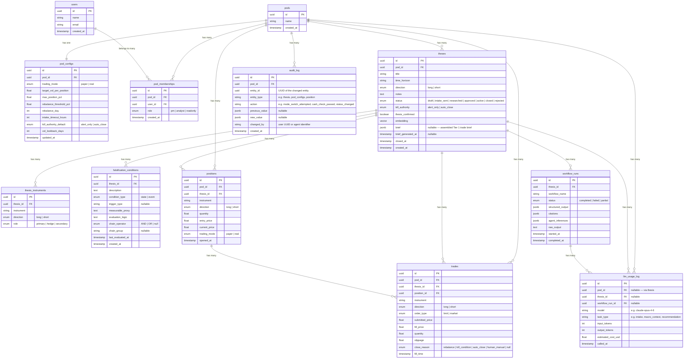

# Entity Relationship Diagram
## Core Tables


```

---

## Notes

- All PKs are UUID v4, generated in the application layer before database write
- `pods` is the top-level entity — all other core tables have a `pod_id` FK either directly or via `theses`
- `pod_configs` is one-to-one with `pods` — created by the seed script on pod creation with default values
- `falsification_conditions.chain_operator` and `chain_group` are nullable — reserved for v2 condition chain logic
- `trades.close_reason` is nullable — only populated on closing trades, not opening trades
- `theses.embedding` is a pgvector column for semantic thesis search
- `theses.brief` is a JSONB snapshot of the assembled Tier 1 trade brief, regenerated whenever the research pipeline completes; referenced directly by `thesis_id` rather than a separate object store (see PRD Section 8.2)
- `workflow_runs` stores full agent output as JSONB — raw_output is kept for debugging but not passed between workflow steps; only structured_output is consumed downstream
- `positions.trading_mode` records which account the position lives in at time of opening — this is a snapshot, not a live reference to pod_configs
- `audit_log` is append-only — no UPDATE or DELETE permitted at the database level; every step in a multi-step operation gets its own row written immediately
- `audit_log.entity_id` + `entity_type` together identify what changed; `action` names the specific step (e.g. `mode_switch_attempted`, `cash_check_failed`, `thesis_status_changed`)
- `llm_usage_log` is append-only — records every Anthropic API call with token counts and estimated cost at time of call; all FKs are nullable since not all calls originate from a workflow run
